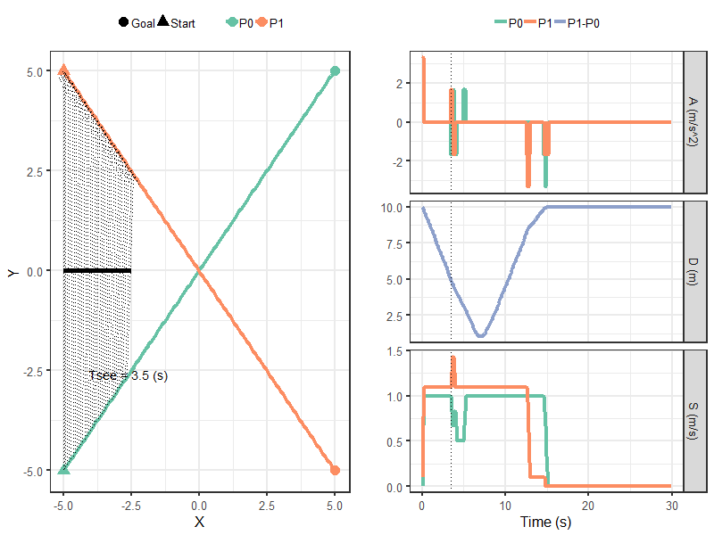
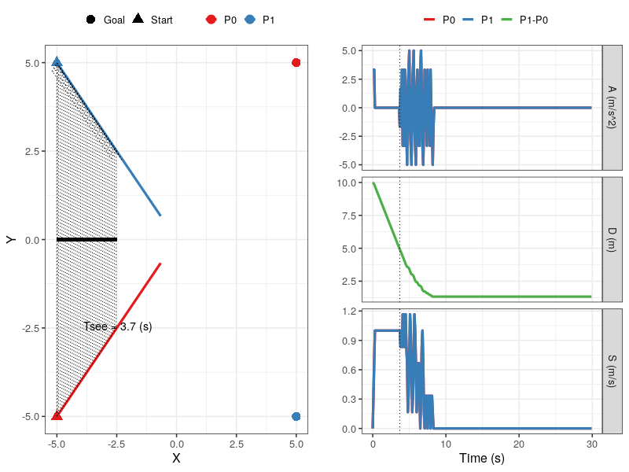

=====================================================
LAPF: Kinematics Leading Agent Passes First 
=====================================================

.. sectnum::

.. contents:: Table of contents

Simulating Trajectories
~~~~~~~~~~~~~~~~~~~~~~~~~

The first line defines start time = 0 s and end time = 30 s, and then defines
time step = .1, s action time interval = .3 s

::

    time <- c(0, 30, .1, .3)
    pos  <- matrix(c(-5, -5, -5, 5), ncol=2); pos
    goal <- matrix(c(5, 5, 5, -5), ncol=2); goal

The options of speed and heading direction. Define x1, y1 and x2 y2 for the wall

::

    so <- matrix( rep(c(-1, .5, 1), 2), ncol=2)
    ao <- matrix( rep(c(-10, 0, 10), 2), ncol=2)
    wall <- c(-5, 0, -2.5, 0)

List all speed combinations

::

    speed_options <- test_regspace(0, .1, 1)[,1]
    speeds <- get_speed_list(speed_options)  ## 10 speed options
    ## [1] 0.0 0.1 0.2 0.3 0.4 0.5 0.6 0.7 0.8 0.9
    nrow(speeds)  ## 10 x 10 = 100 different speed pairs (for P0 and P1)

Prepare the containers to store scoring results. First set up n = 1000 possible
parameter pairs (i.e., [kc kdv]), storing them in a 1000-element list.

::

    ## n <- 10   ## Test run
    n <- 1000    ## actual run
    parameters <- vector("list", length = n)

Then set up containers to store scoring of different behaviours

::

    P1KL <- P2FA <- P3SD <- P2FD <- matrix(rep(FALSE, n*nrow(speeds)), ncol=n)
    P3SA <- X4P0 <- X4P1 <- matrix(rep(FALSE, n*nrow(speeds)), ncol=n)
    isovershoot0 <- isovershoot1 <- matrix(rep(FALSE, n*nrow(speeds)), ncol=n)
    iscolliding <- matrix(rep(FALSE, n*nrow(speeds)), ncol=n)

    farfrom_reaching_goal0 <- matrix(rep(FALSE, n*nrow(speeds)), ncol=n)
    farfrom_reaching_goal1 <- matrix(rep(FALSE, n*nrow(speeds)), ncol=n)

    alread_reach_free_speed0 <- matrix(rep(FALSE, n*nrow(speeds)), ncol=n)
    alread_reach_free_speed1 <- matrix(rep(FALSE, n*nrow(speeds)), ncol=n)

**cd** stands for collisoin distance, representing the collision distances for
each agent. Legacy code for default steering ratio for the agent 1 and agent 2.

::

    cd <- c(1, 1)
    sr <- c(0, 0)

Run an example trajectory.

::

    kc <- runif(1, 0, 10)
    kdv <- runif(1, .28, .71)
    parameters[[1]] <- list(P0 = c(type=0, kg=1, kc=kc, kdv=kdv, ke=0),
                        P1 = c(type=0, kg=1, kc=kc, kdv=kdv, ke=0))
    path <- paste0("tests/testthat/Group2_P1KL/figs/para", i)
    if (!dir.exists(path)) { dir.create(path) }
    init_speed <- speeds[j, ]
    traj <- test_P2P(time, parameters[[i]], pos, goal, so, ao, init_speed,
                 init_angle, obstacles, cd, sr, wall)
    png(file="figs/P1KL_example.png", 800, 600)
    plot_2traj_no_angle(traj, wall=wall, col="Set2")

Use a simple two-layer for loops to step through the parameter pairs and the
speed pairs.

::

    for (i in seq_len(n)) 
    {
        ## Cv = kdv; Ct = ke; k_g and C_t == 1
        ## Two identical agents
        kc <- runif(1, 0, 10)
        kdv <- runif(1, .28, .71)
        parameters[[i]] <- list(P0 = c(type=0, kg=1, kc=kc, kdv=kdv, ke=0),
                            P1 = c(type=0, kg=1, kc=kc, kdv=kdv, ke=0))
        # path <- paste0("tests/testthat/Group2_P1KL/figs/para", i)
        # if (!dir.exists(path)) { dir.create(path) }
  
        for (j in seq_len(nrow(speeds))) 
        {
            init_speed <- speeds[j, ]
            traj <- test_P2P(time, parameters[[i]], pos, goal, so, ao, init_speed,
                         init_angle, obstacles, cd, sr, wall)
            # png(file="figs/X4_issue.png", 800, 600)
            plot_2traj_no_angle(traj, wall=wall, col="Set2")

            nt <- length(traj$times)
            delta_x_traj <- traj$x[2,] - traj$x[1,]
            delta_y_traj <- traj$y[2,] - traj$y[1,]
            distance_traj <- sqrt(delta_x_traj^2+ delta_y_traj^2)
            is_colliding_traj <- distance_traj < cd[1]
            if (any(is_colliding_traj)) iscolliding[j, i] <- TRUE
            
            tmp0 <- find_tsee(traj, wall=wall); 
            tmp1 <- who_pass_first(traj); 
        
            
            D0 <- get_distance(v0 = traj$goal[,1],
                               v1 = c(traj$x[1, nt], traj$y[1, nt])); 
            D1 <- get_distance(v0 = traj$goal[,2],
                               v1 = c(traj$x[2, nt], traj$y[2, nt])); 
            
            test2 <- traj$x[1, nt] < traj$goal[1, 1] &&
                     traj$y[1, nt] < traj$goal[2, 1] && D0 > .5 
            test3 <- traj$x[2, nt] < traj$goal[1, 2] &&
                     traj$y[2, nt] < traj$goal[2, 2] && D1 > .5 
            
            if (test2 && test3) {
              farfrom_reaching_goal0[j, i] <- farfrom_reaching_goal0[j, i] <- TRUE
            }
            if (test2) { farfrom_reaching_goal0[j, i] <- TRUE }
            if (test3) { farfrom_reaching_goal1[j, i] <- TRUE }
            
            ## No agent overshoot more than .5 meter beyond the goal 
            
            ## Whether agents have 0 acc before Tsee
            agent0_acc <- traj$accelerations[1,1:tmp0$i_tsee] == 0
            agent1_acc <- traj$accelerations[2,1:tmp0$i_tsee] == 0
            test4 <- sum(agent0_acc) > 0
            test5 <- sum(agent1_acc) > 0
          
            if (test4) { alread_reach_free_speed0[j, i] <- TRUE }
            if (test5) { alread_reach_free_speed1[j, i] <- TRUE }
            
      
            for (k in 1:nt) {
                D2 <- get_distance(v0 = traj$goal[,1],
                                   v1 = c(traj$x[1, k], traj$y[1, k]))
                D3 <- get_distance(v0 = traj$goal[,2],
                                   v1 = c(traj$x[2, k], traj$y[2, k]))
                
                test0 <- traj$x[1, k] > traj$goal[1, 1] && 
                         traj$y[1, k] > traj$goal[2, 1] &&
                         D2 > .5
                test1 <- traj$x[2, k] > traj$goal[1, 2] &&
                         traj$y[2, k] < traj$goal[2, 2] &&
                         D3 > .5
      
                if (test0 && test1) { 
                  isovershoot0[j,i] <- isovershoot1[j,i]  <- TRUE
                  cat("Both agent overshooted\n")
                  #stop("Both agent overshooted\n")
                  break
                }
                if (test0) {
                  isovershoot0[j,i] <- TRUE
                  cat("P0 overshooted\n")
                  #stop("P0 overshooted\n")
                  break
                }
                if (test1) {
                  isovershoot1[j,i] <- TRUE
                  cat("P1 overshooted\n")
                  #stop("P1 overshooted\n")
                  break
                }
                
                if (k > 30 && k < tmp0$i_tsee)
                {
                  X4P0[j, i] <- traj$accelerations[1,k]==0
                  X4P1[j, i] <- traj$accelerations[2,k]==0
                  break
                }
                
            } ## end of k; time-step loop 
            
              
            ## P1KL etc...
            if (is.na(tmp0$lead_agent)) {
                #cat("No leading agent\n")
                P1KL[j, i] <- NA
            } else if (is.na(tmp1$who_passed)) {
               # cat("Neither passed earlier\n")
                P1KL[j, i] <- NA
            } else if ( tmp0$lead_agent == tmp1$who_passed ) {
                P1KL[j, i] <- TRUE
            } else {
               #cat("Leading agent did not pass first\n")
            }
            
            
            if (is.na(P1KL[j, i])) {
              cat("Trajectory abnormal\n")
              P2FA[j, i] <- NA
              P3SD[j, i] <- NA
              P2FD[j, i] <- NA
              P3SA[j, i] <- NA
            } else if (P1KL[j, i] == TRUE && tmp1$who_passed == "A0") {
              ## First passer accelerates; A0 is stored in row 1
              P2FA[j, i] <- ifelse(traj$speed[1, tmp0$i_tsee + 5] >
                                   traj$speed[1, tmp0$i_tsee], TRUE, FALSE)
              ## Second passer decelerates
              P3SD[j, i] <- ifelse(traj$speed[2, tmp0$i_tsee + 5] <
                                   traj$speed[2, tmp0$i_tsee], TRUE, FALSE)
              
              ## First passer decelerates
              P2FD[j, i] <- ifelse(traj$speed[1, tmp0$i_tsee + 5] <
                                   traj$speed[1, tmp0$i_tsee], TRUE, FALSE)
              
              ## Second passer accelerates
              P3SA[j, i] <- ifelse(traj$speed[2, tmp0$i_tsee + 5] >
                                   traj$speed[2, tmp0$i_tsee], TRUE, FALSE)
              
            } else if (P1KL[j, i] == TRUE && tmp1$who_passed == "A1") {
              P2FA[j, i] <- ifelse(traj$speed[2, tmp0$i_tsee + 5] >
                                   traj$speed[2, tmp0$i_tsee], TRUE, FALSE)
              P3SD[j, i] <- ifelse(traj$speed[1, tmp0$i_tsee + 5] <
                                   traj$speed[1, tmp0$i_tsee], TRUE, FALSE)
              
              ## First passer decelerates
              P2FD[j, i] <- ifelse(traj$speed[2, tmp0$i_tsee + 5] <
                                   traj$speed[2, tmp0$i_tsee], TRUE, FALSE)
              
              ## Second passer accelerates
              P3SA[j, i] <- ifelse( traj$speed[1, tmp0$i_tsee + 5] >
                                      traj$speed[1, tmp0$i_tsee], TRUE, FALSE)
              
            } else {
              ## cat("Leading agent did not pass first\n")
            }
            
      
        }  ## end of j; speed-option loop
    }      ## end of i; parameter loop

Although the double loops may not take too long to run, if one use a good
PC. It is not a bad idea to use R.exe CMD BATCH.

::

    "path to your R bin\bin\R.exe" CMD BATCH path2yourscipt\test_P1KL.R &

Step-by-Step Explanation
~~~~~~~~~~~~~~~~~~~~~~~~~

**traj$x** and **traj$y** are :math:`2 \times 300` matrix, storing the 
coordinates on the x and y axis evolving over the time. 
Thererfore, **delta_traj** is the moment-to-moment distance between the two 
agents.

.. math::

    \sqrt{(x_2 - x_1)^2  + (y_2- y_1)^2 }

::

    # num [1:2, 1:300] -5 -5 -4.98 -4.98 -4.93 ...
    delta_x_traj <- traj$x[2,] - traj$x[1,]
    delta_y_traj <- traj$y[2,] - traj$y[1,]
    distance_traj <- sqrt(delta_x_traj^2+ delta_y_traj^2)

In this case, *P0* stopped at [-0.66  -0.66] and *P1* stopped at [-0.66  0.66].

There final distance was 1.3 meters apart (right panel, row D). Therefore,
these two agents had never stepped into their collision proximity, defined in
**cd**. This fact was recored in **iscolliding**.

::

    is_colliding_traj <- distance_traj < cd[1]
    if (any(is_colliding_traj)) iscolliding[j, i] <- TRUE

**find_tsee** finds when the two agents start to notice each other. 
It returns t :sub:`see` at 3.7 seconds, which is at the index 38. From P0's 
perspective when at the t :sub:`see`, it still needed 3.5 seconds (t2M1) to 
travel to the crossing point, which was still 3.5 meters away (D2M1). 
(t2M1). **t2M2** and **D2M2** are same statistics from P1's perspective. The
last element reported that no leading agent in this case.

::

    tmp0 <- find_tsee(traj, wall=wall, verbose = TRUE); unlist(tmp0)
    # tsee     i_tsee       t2M1       t2M2       D2M1       D2M2 lead_agent 
    # 3.7       38.0        3.5        3.5        3.5        3.5         NA 

The **verbose** option prints the t :sub:`see` test.
::

      tmp0 <- find_tsee(traj, wall=wall, verbose = TRUE); 
      # Equal time to midpoint
      tmp1 <- who_pass_first(traj, verbose = TRUE); 
      # Neither A0 nor A1 passed midpoint

**get_distance** calculate the distance between agent's last position to its 
destination. *test2* and *test3* thus test whether agents were still far away
(> 0.5 meter) from their destination. These results were stored thereafter.

::

      D0 <- get_distance(v0 = traj$goal[,1],
                         v1 = c(traj$x[1, nt], traj$y[1, nt])); 
      D1 <- get_distance(v0 = traj$goal[,2],
                         v1 = c(traj$x[2, nt], traj$y[2, nt])); 
      
      test2 <- traj$x[1, nt] < traj$goal[1, 1] &&
               traj$y[1, nt] < traj$goal[2, 1] && D0 > .5 
      
      test3 <- traj$x[2, nt] < traj$goal[1, 2] &&
               traj$y[2, nt] > traj$goal[2, 2] && D1 > .5 

      if (test2) { farfrom_reaching_goal0[j, i] <- TRUE }
      if (test3) { farfrom_reaching_goal1[j, i] <- TRUE }
       
Next, we examined the evoluation of the accelerations. If the accelerations
became 0, it implies that the agents have reached their free speeds before 
t :sub:`see`.
     
::

      agent0_acc <- traj$accelerations[1,1:tmp0$i_tsee] == 0
      agent1_acc <- traj$accelerations[2,1:tmp0$i_tsee] == 0
      test4 <- sum(agent0_acc) > 0
      test5 <- sum(agent1_acc) > 0
    
      if (test4) { alread_reach_free_speed0[j, i] <- TRUE }
      if (test5) { alread_reach_free_speed1[j, i] <- TRUE }

Then we scanned through agents' standing at every time point and examined
whether they had stepped over their destinations more than 0.5 meter. 

Passing Destination
******************************

::

    for (k in 1:nt) {
        D2 <- get_distance(v0 = traj$goal[,1],
                   v1 = c(traj$x[1, k], traj$y[1, k]))
        D3 <- get_distance(v0 = traj$goal[,2],
                   v1 = c(traj$x[2, k], traj$y[2, k]))

        test0 <- traj$x[1, k] > traj$goal[1, 1] && 
                 traj$y[1, k] > traj$goal[2, 1] && D2 > .5
        test1 <- traj$x[2, k] > traj$goal[1, 2] &&
                 traj$y[2, k] < traj$goal[2, 2] && D3 > .5

        if (test0 && test1) { 
            isovershoot0[j,i] <- isovershoot1[j,i]  <- TRUE
            cat("Both agent overshooted\n")
            #stop("Both agent overshooted\n")
            break
        }
        if (test0) {
            isovershoot0[j,i] <- TRUE
            cat("P0 overshooted\n")
            #stop("P0 overshooted\n")
            break
        }
        if (test1) {
            isovershoot1[j,i] <- TRUE
            cat("P1 overshooted\n")
            #stop("P1 overshooted\n")
            break
        }

        # This step checks whether the agents immaturely stop before tsee
        if (k > 30 && k < tmp0$i_tsee)
        {
            X4P0[j, i] <- traj$accelerations[1,k]==0
            X4P1[j, i] <- traj$accelerations[2,k]==0
            break
        }

    } ## end of k looping over time

Scoring
**********************

Scoring whether leading agent passes first happened.

    if (is.na(tmp0$lead_agent)) {
        #cat("No leading agent\n")
        P1KL[j, i] <- NA
    } else if (is.na(tmp1$who_passed)) {
       # cat("Neither passed earlier\n")
       P1KL[j, i] <- NA
    } else if ( tmp0$lead_agent == tmp1$who_passed ) {
       P1KL[j, i] <- TRUE
    } else {
       #cat("Leading agent did not pass first\n")
    }

If P1KL resulted in not available, other associated behaviours score NA, too.
If P1KL resulted scored and the agent 0 (A0) passed the crossing point also 
earlier than agent 1, we check whether A0 accelerated by looking five steps
later if its speed became faster than its current speed at the t :sub:`see`.
Similarly, we applied such check on the behaviours of the second agent 
deceleration, the first agent deceleration, and the second agent acceleration.
This applied also to when the agent 1 was the lead agent.  

::

    if (is.na(P1KL[j, i])) {
        cat("Trajectory abnormal\n")
        P2FA[j, i] <- NA
        P3SD[j, i] <- NA
        P2FD[j, i] <- NA
        P3SA[j, i] <- NA
    } else if (P1KL[j, i] == TRUE && tmp1$who_passed == "A0") {
        ## First passer accelerates; A0 is stored in row 1
        P2FA[j, i] <- ifelse(traj$speed[1, tmp0$i_tsee + 5] >
                         traj$speed[1, tmp0$i_tsee], TRUE, FALSE)
        ## Second passer decelerates
        P3SD[j, i] <- ifelse(traj$speed[2, tmp0$i_tsee + 5] <
                         traj$speed[2, tmp0$i_tsee], TRUE, FALSE)
    
        ## First passer decelerates
        P2FD[j, i] <- ifelse(traj$speed[1, tmp0$i_tsee + 5] <
                         traj$speed[1, tmp0$i_tsee], TRUE, FALSE)
    
        ## Second passer accelerates
        P3SA[j, i] <- ifelse(traj$speed[2, tmp0$i_tsee + 5] >
                         traj$speed[2, tmp0$i_tsee], TRUE, FALSE)
    
    } else if (P1KL[j, i] == TRUE && tmp1$who_passed == "A1") {
        P2FA[j, i] <- ifelse(traj$speed[2, tmp0$i_tsee + 5] >
                         traj$speed[2, tmp0$i_tsee], TRUE, FALSE)
        P3SD[j, i] <- ifelse(traj$speed[1, tmp0$i_tsee + 5] <
                         traj$speed[1, tmp0$i_tsee], TRUE, FALSE)
    
        ## First passer decelerates
        P2FD[j, i] <- ifelse(traj$speed[2, tmp0$i_tsee + 5] <
                         traj$speed[2, tmp0$i_tsee], TRUE, FALSE)
    
        ## Second passer accelerates
        P3SA[j, i] <- ifelse( traj$speed[1, tmp0$i_tsee + 5] >
                          traj$speed[1, tmp0$i_tsee], TRUE, FALSE)
    
    } else {
        ## cat("Leading agent did not pass first\n")
    }

Analyses
~~~~~~~~~~~~~~~~~~~~~~~~~

First, collect data as a data frame.  Define a criterion of > than 80% 
amongst 100 different initial speed pairs. Each element in **parameters** stores
a pair of parameter set, representing P0 and P1.

::

    parameters[[1]]
    # $P0
    #     type        kg        kc       kdv        ke 
    # 0.0000000 1.0000000 3.0028922 0.5861449 0.0000000 
    # $P1
    #     type        kg        kc       kdv        ke 
    # 0.0000000 1.0000000 3.0028922 0.5861449 0.0000000 

    nparameter <- length(parameters)
    kc_P0  <- kc_P1 <- rep(NA, nparameter)
    kdv_P0  <- kdv_P1 <- rep(NA, nparameter)
    for(i in 1:length(parameters)) 
    {
        kc_P0[i]  <- parameters[[i]]$P0[3]
        kc_P1[i]  <- parameters[[i]]$P1[3]
        kdv_P0[i] <- parameters[[i]]$P0[4]
        kdv_P1[i] <- parameters[[i]]$P1[4]
    }

**colMeans** gets the probability for each parameter set
